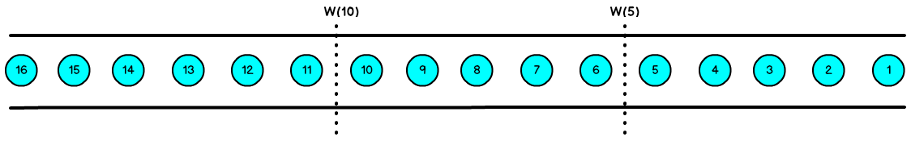
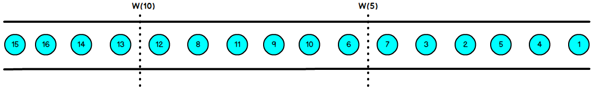

# (一)Flink：watermarkStrategy And TimeCharacteristic-1

## Event time and Watermarks

### 概念

Flink明确支持的三种时间语义：

1. 事件时间---event time[^源码注释eventTime]:     <u>事件产生的时间</u> , 记录的是设备生产（或存储）事件的时间
2. 摄取时间---ingestion time [^源码注释ingestionTime] :     Flink<u>读取事件</u> 时记录的时间
3. 处理时间---processing time[^源码注释processingTime] :   Flink pipeline 中具体<u>算子处理事件时间</u>    

说明：

> 使用事件时间： <u>可以获得重现的结果</u> ，如在计算过去的特定一天里第一个小时的股票最高价格。这样无论什么时间计算都不会影响输出结果。
>
> 使用处理时间： 实时应用程序的结果是由程序运行的时间所决定的。多次运行基于处理时间的实时程序，可能的到的结果不相同。也可能导致再次分析历史数据或者测试新代码变得异常困难。

### 使用 Event Time

使用事件时间，需要额外给Flink提供一个时间戳提取器和watermark生成器。

Flink使用他们来跟踪事件时间的进度。

### Watermarks

数据乱序：`指Flink接收到的事件的先后顺序不是严格按照事件时间的Event Time顺序排列的。` 

watetmarks的作用：`它们定义何时停止等待较早的事件` 

> 1. watermark是一种衡量 Event Time进展的机制，它是数据本身的一个隐藏属性， 数据本身携带着对应的watermark。
>
> 2. watermark是用来处理乱序事件的，而正确的处理乱序事件，通常用watermark机制结合windwo来实现。
> 3. 数据流中的watermark用于表示timestampi小于watermark的数据，都已经到达了，因此，window的执行也是由watermark触发的。
> 4. <u>watermark可以理解成一个延迟触发机制，我们可以设置watermark的延时时长为t，每次系统会校验已经到达的数据最大的maxEventTime，然后认定eventTime 小于 maxEventTime -t 的所有数据已经到达，如果有窗口的停止时间等于maxEvetnTime -t ， 那么这个窗口被触发执行</u> 

Flink中实践时间的处理取决于watermark生成器，后者将带有时间戳的特殊元素插入流中形成watermarks。

事件时间t的watermark代表t之前（很可能）都已经到达。

当watermark以某一时间戳t到达时，事件流的排序器停止等待，并输出t作为已经排序好的流。

#### 有序流的watermark处理：`watermark设置为0` 

#### 无序流的watermark处理： `watermark设置为2` 

> 1. 当Flink接收到没一条数据时，都会产生一条watermark;
> 2. 这条watermark就等于当前所的有到达的数据中的maxEventTime -t(延迟时长);
> 3. 就是说，watermark是由数据携带的，一旦数据携带的watermark比当前未触发的窗口的停止时间晚，就会触发相应窗口的执行;
> 4. 由于watermark是由数据携带的，因此，如过果在运行中无法获得新的数据，那么没有被触发的窗口就会永远都不被触发;
> 5. 如上两图所示：窗口1是1s~5s、窗口2是6s ~10s，那么时间戳为7s的事件到达时的watermark恰好触发窗口1,时间戳为12s的事件到达的时候watermark恰好触发窗口2.
> 6. watermark就是触发前一窗口的“关窗时间”， 一旦触发关门那么以当前时刻为准在窗口范围内的所有数据都会收如窗中。

> 思考：如何决定watermarks的不同生成策略？

### 延迟VS正确性

watermarks给了开发者流处理的一种选择，使开发者在开发应用程序时可以控制延迟和完整性之间权衡。

这里体现出流式数据处理和批处理的不同：

> 批处理：可以在生产任何结果之前完全了解输入，
>
> 流处理：不能等待所有时间（数据）都产生了，再排好序，这与流相违背。

流式数据处理中的watermarks使用：

> watermarks的边界时间配置的相对较短，从而冒着在输入不完全的情况下产生结果的风险-错误结果。
>
> watermarks的边界时间配置的相对较长，并利用对输入流的更全面的了解来产生结果。
>
> 也可以混合使用两种方式[^ 混合方式]， 首先快速产生初步结果，然后在处理新的数据时i向这些结果提供更新。
>
> [^ 混合方式]: 混合方式适用于对延迟容忍度很低，但是又对结果有很严格的要求的场景。

### 延迟

延迟是相对于watermarks定义的。

watermark(t)表示事件流的时间已经到达了t， watermark之后的时间戳 ≤ *t* 的任何事件都被称为延迟事件。

[^源码注释processingTime]: Processing time for operators means that the operator uses the system clock of the machine to determine the current time of the data stream. Processing-time windows trigger based on wall-clock time and include whatever elements happen to have arrived at the operator at that point in time. Using processing time for window operations results in general in quite non-deterministic results, because the contents of the windows depends on the speed in which elements arrive. It is, however, the cheapest method of forming windows and the method that introduces the least latency.
[^源码注释ingestionTime]: Ingestion time means that the time of each individual element in the stream is determined when the element enters the Flink streaming data flow. Operations like windows group the elements based on that time, meaning that processing speed within the streaming dataflow does not affect windowing, but only the speed at which sources receive elements. Ingestion time is often a good compromise between processing time and event time. It does not need any special manual form of watermark generation, and events are typically not too much out-or-order when they arrive at operators; in fact, out-of-orderness can only be introduced by streaming shuffles or split/join/union operations. The fact that elements are not very much out-of-order means that the latency increase is moderate, compared to event time.
[^源码注释eventTime]: Event time means that the time of each individual element in the stream (also called event) is determined by the event's individual custom timestamp. These timestamps either exist in the elements from before they entered the Flink streaming dataflow, or are user-assigned at the sources. The big implication of this is that it allows for elements to arrive in the sources and in all operators out of order, meaning that elements with earlier timestamps may arrive after elements with later timestamps. Operators that window or order data with respect to event time must buffer data until they can be sure that all timestamps for a certain time interval have been received. This is handled by the so called "time watermarks". Operations based on event time are very predictable - the result of windowing operations is typically identical no matter when the window is executed and how fast the streams operate. At the same time, the buffering and tracking of event time is also costlier than operating with processing time, and typically also introduces more latency. The amount of extra cost depends mostly on how much out of order the elements arrive, i.e., how long the time span between the arrival of early and late elements is. With respect to the "time watermarks", this means that the cost typically depends on how early or late the watermarks can be generated for their timestamp. In relation to {@link #IngestionTime}, the event time is similar, but refers the the event's original time, rather than the time assigned at the data source. Practically, that means that event time has generally more meaning, but also that it takes longer to determine that all elements for a certain time have arrived.
