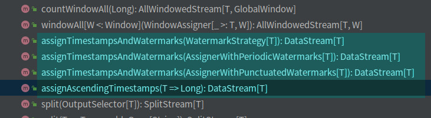

# (一)Flink：watermarkStrategy And TimeCharacteristic-2

## watermark的使用

### 背景

在Flink1.11中对Flink的水印生成接口进行了重构;

flink1.11之前的版本中提供了两种生成水印的策略：

> 1. ~~AssignerWithPunctuateWatermarks~~ 
> 2. ~~AssignerWithPeriodicWatermarks~~ 

这两个接口都是继承自TimestampAssigner接口

在flink1.11及之后的版本中，DataStream生成水印策略的方法如下：



> 1. 其中assignTimestampsAndWatermarks(WatermarkStrategy[T]): DataStream[T]是通用的，不用向之前的版本来区分Punctuate和Periodic;
> 2. `assignTimestampsAndWatermarks(AssignerWithPeriodicWatermarks[T]): DataStream[T]` 和`assignTimestampsAndWatermarks(AssignerWithPunctuatedWatermarks[T]): DataStream[T]` 均使用了上述已经弃用的水印生成接口;
> 3. `assigneAscendingTimestamps(T => Long): DataStream[T]` 适用于元素的时间戳单调递增的数据流; 

### 使用新的通用接口生成水印

#### 1. 构建DataStream后，使用assignTimestampsAndWatermarks()方法来构造水印;

新的接口需要传入一个WatermarkStrategy[T] [^源码注释WatermarkStrategy]

``` scala 
DataStream.assignTimestampsAndWatermarks(WatermarkStrategy[T]) 
```


[^源码注释WatermarkStrategy]: The WatermarkStrategy defines how to generate {@link Watermark}s in the stream sources. The WatermarkStrategy is a builder/factory for the {@link WatermarkGenerator} that generates the watermarks and the {@link TimestampAssigner} which assigns the internal timestamp of a record. This interface is split into three parts: 1) methods that an implementor of this interface needs to implement, 2) builder methods for building a {@code WatermarkStrategy} on a base strategy, 3) convenience methods for constructing a {code WatermarkStrategy} for common built-in strategies or based on a {@link WatermarkGeneratorSupplier} Implementors of this interface need only implement {@link #createWatermarkGenerator(WatermarkGeneratorSupplier.Context)}. Optionally, you can implement {@link #createTimestampAssigner(TimestampAssignerSupplier.Context)}. The builder methods, like {@link #withIdleness(Duration)} or {@link #createTimestampAssigner(TimestampAssignerSupplier.Context)} create a new {@code WatermarkStrategy} that wraps and enriches a base strategy. The strategy on which the method is called is the base strategy. The convenience methods, for example {@link #forBoundedOutOfOrderness(Duration)}, create a {@code WatermarkStrategy} for common built in strategies. This interface is {@link Serializable} because watermark strategies may be shipped to workers during distributed execution.
