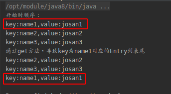
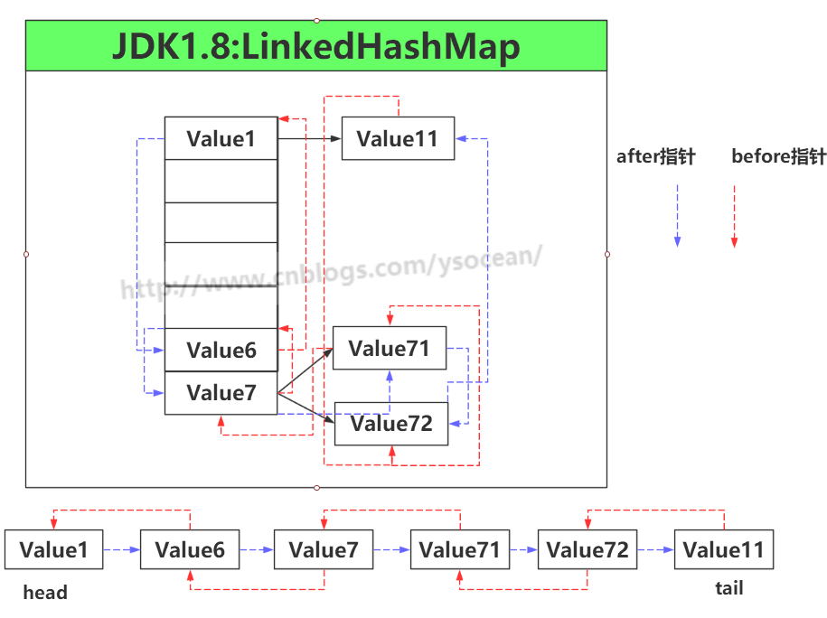
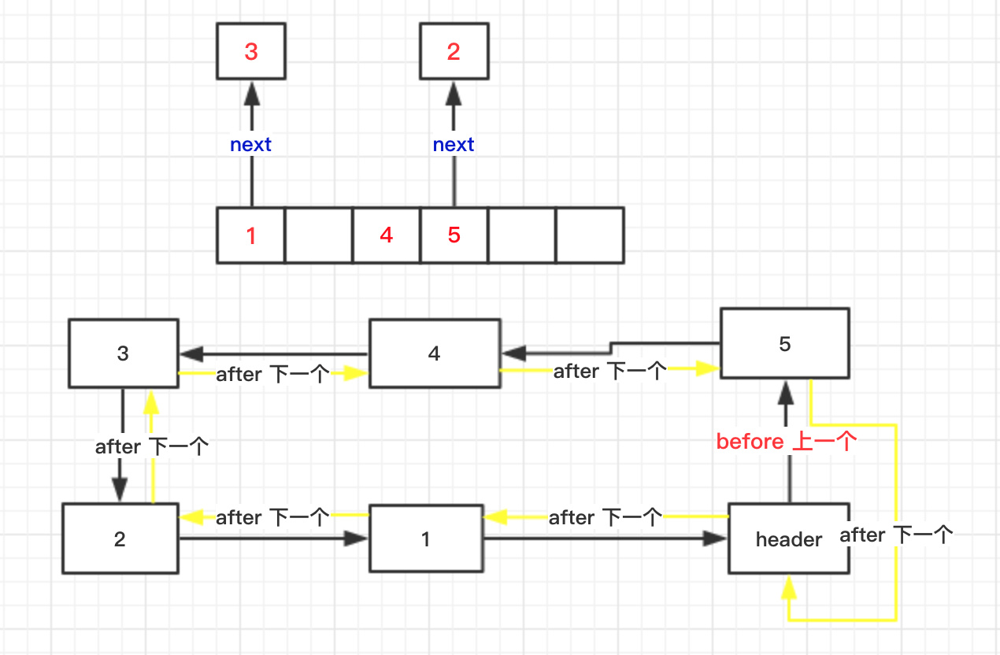

# Java 集合框架（LinkedHashMap）

## 1. LinkedHashMap底层分析

1. HashMap是一个无序的Map，因为每次根据key的hashCode映射到Entry数组上，所以遍历出来的顺序并不是写入的顺序
2. JDK推出了一个基于HashMap但是有顺序的LinkedHashMap来解决有排序需求的场景
3. 它的底层是继承于HashMap实现的，由一个双向链表所构成。
4. LinkedHashMap的排序方式有两种：
   1. 根据写入顺序排序
   2. 根据访问顺序排序

5. 其中根据访问顺序排序时，每次get都会访问的值移动到链表末尾，这样重复操作就能得到一个按照访问顺序排序的链表

### 1.1 默认是插入顺序
在LinkedHashMap的构造方法中可以看出默认顺序是插入顺序

```java
    public LinkedHashMap() {
        // 调用HashMap的构造方法，其实就是初始化Entry[] table
        super();
        // 这里是指是否基于访问排序，默认为false
        accessOrder = false;
    }
```

`accessOrder=false`存储顺序：表示LinkedHashMap中存储的顺序是按照调用put方法插入的顺序排序的。

`accessOrder=true`访问顺序：表示LinkedHashMap中调用了get后，对应的Entry会移动到最后，这就是访问顺序。

```java
                // 第三个参数用于指定accessOrder值
        Map<String, String> linkedHashMap = new LinkedHashMap<>(16, 0.75f, true);
        linkedHashMap.put("name1", "josan1");
        linkedHashMap.put("name2", "josan2");
        linkedHashMap.put("name3", "josan3");
        System.out.println("开始时顺序：");
        Set<Entry<String, String>> set = linkedHashMap.entrySet();
        Iterator<Entry<String, String>> iterator = set.iterator();
        while(iterator.hasNext()) {
            Entry entry = iterator.next();
            String key = (String) entry.getKey();
            String value = (String) entry.getValue();
            System.out.println("key:" + key + ",value:" + value);
        }
        System.out.println("通过get方法，导致key为name1对应的Entry到表尾");
        linkedHashMap.get("name1");
        Set<Entry<String, String>> set2 = linkedHashMap.entrySet();
        Iterator<Entry<String, String>> iterator2 = set2.iterator();
        while(iterator2.hasNext()) {
            Entry entry = iterator2.next();
            String key = (String) entry.getKey();
            String value = (String) entry.getValue();
            System.out.println("key:" + key + ",value:" + value);
        }
```

结果为：




### 1.2 根据成员变量（accessOrder）可设置为按照访问顺序

```java
LinkedHashMap<String,String> map = new LinkedHashMap<>(16,0.75F,true);
```





