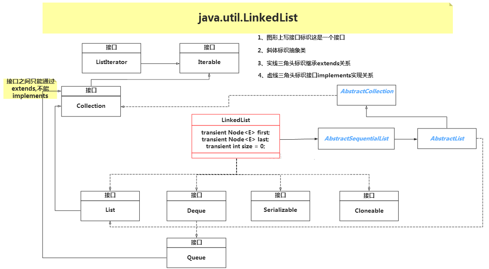
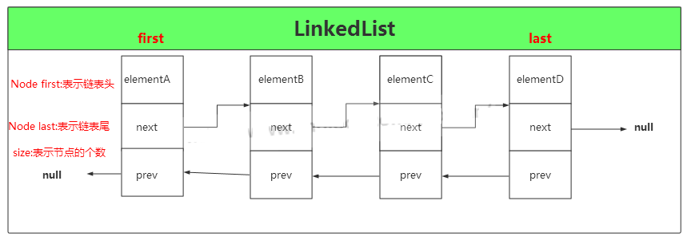

# Java 结合框架（LinkedList）

## LinkedList定义

==linkedList是一个用链表实现的集合，元素有序且可以重复==

```java
public class LinkedList<E>   extends AbstractSequentialList<E>    
    implements List<E>, Deque<E>, Cloneable, java.io.Serializable
```



1. LinkedList集合实现了Cloneable接口和Serializable接口, 分别用来支持克隆以及支持序列化
2. LinkedList集合实现了一个Deque接口，这是一个双向队列接口，双向队列就是两端口都可以进行增加和删除操作

## 字段属性

```java
//链表元素（节点）的个数
    transient int size = 0;
    /**
     *指向第一个节点的指针
     */
    transient Node<E> first;
    /**
     *指向最后一个节点的指针
     */
    transient Node<E> last;
```

Node类，是LinkedList类中的一个内部类，其中没一个元素就代表这一个Node对象，LinkedList集合就是由许多个Node对象类‘手拉手构成的’

```java
private static class Node<E> {
        E item;//实际存储的元素
        Node<E> next;//指向上一个节点的引用
        Node<E> prev;//指向下一个节点的引用

        //构造函数
        Node(Node<E> prev, E element, Node<E> next) {
            this.item = element;
            this.next = next;
            this.prev = prev;
        }
    }
```



上图中LinkedList是四个元素，有4个Node对象组成，size=4, head指向地一个elementA, tail指向最后一个节点elementD

## 构造函数

```java
public LinkedList() {
    }
    public LinkedList(Collection<? extends E> c) {
        this();
        addAll(c);
    }
```

LinkedList 有两个构造函数，

第一个是默认的空的构造函数，

第二个是将已有元素的集合Collection 的实例添加到 LinkedList 中，

==注意：LinkedList 是没有初始化链表大小的构造函数，因为链表不像数组，一个定义好的数组是必须要有确定的大小，然后去分配内存空间，而链表不一样，它没有确定的大小，通过指针的移动来指向下一个内存地址的分配。==

## 添加元素

### addFirst（E e) : 将指定元素添加到链表头部


### addLast(E e) 和 add(E e)将指定元素添加到链表尾部


### add(int index, E elememt): 将指定的元素插入此列表中的指定位置

### addAll(Collection<? extends E > c)

按照指定集合的迭代器返回的顺序，将指定集合中的所有元素追加到此列表的末尾


### addAll(int index, Collection<? extends E> c)

将集合c中的所有元素插入到制定索引的位置


## 修改元素

### set(int index, E element)方法

用指定的元素替换此列表中指定位置的元素

```java
public E set(int index, E element) {
        //判断索引 index >= 0 && index <= size中时抛出IndexOutOfBoundsException异常
        checkElementIndex(index);
        Node<E> x = node(index);//获取指定索引处的元素
        E oldVal = x.item;
        x.item = element;//将指定位置的元素替换成要修改的元素
        return oldVal;//返回指定索引位置原来的元素
    }
```

这里主要是通过 node(index) 方法获取指定索引位置的节点，然后修改此节点位置的元素即可。

## 查找元素

### getFirst(): 返回次列表中的地一个元素getlast()

### getLast(): 返回此列表当中最后一个元素

### get(int index): 返回次列表中索引位置为index的元素

### indexOf(Object o): 返回此列表中指定元素第一次出现的索引，如果不包含此元素，则返回-1


## 遍历集合

### 普通for循环

```java
LinkedList<String> linkedList = new LinkedList<>();
linkedList.add("A");
linkedList.add("B");
linkedList.add("C");
linkedList.add("D");
for(int i = 0 ; i < linkedList.size() ; i++){
    System.out.print(linkedList.get(i)+" ");//A B C D
}
```

==注意：==

	1. get(int index)方法每次都要遍历该索引之前所有元素
 	2. 当元素很多时，查找就会花费很多时间
 	3. 虽然有优化--查找前面的，在前面开始找，查找靠后的在后面开始找

### 迭代器

在LinkedList集合中也有个内部类ListItr， 通过移动游标指向每一次要遍历的元素，不用在遍历之前都要从头开始。

demo

```java
LinkedList<String> linkedList = new LinkedList<>();
linkedList.add("A");
linkedList.add("B");
linkedList.add("C");
linkedList.add("D");

Iterator<String> listIt = linkedList.listIterator();
while(listIt.hasNext()){
    System.out.print(listIt.next()+" ");//A B C D
}

//通过适配器模式实现的接口，作用是倒叙打印链表
Iterator<String> it = linkedList.descendingIterator();
while(it.hasNext()){
    System.out.print(it.next()+" ");//D C B A
}
```

原理：

```java
public ListIterator<E> listIterator(int index) {
        checkPositionIndex(index);
        return new ListItr(index);
    }

    private class ListItr implements ListIterator<E> {
        private Node<E> lastReturned;
        private Node<E> next;
        private int nextIndex;
        private int expectedModCount = modCount;

        ListItr(int index) {
            // assert isPositionIndex(index);
            next = (index == size) ? null : node(index);
            nextIndex = index;
        }

        public boolean hasNext() {
            return nextIndex < size;
        }

        public E next() {
            checkForComodification();
            if (!hasNext())
                throw new NoSuchElementException();

            lastReturned = next;
            next = next.next;
            nextIndex++;
            return lastReturned.item;
        }

        public boolean hasPrevious() {
            return nextIndex > 0;
        }

        public E previous() {
            checkForComodification();
            if (!hasPrevious())
                throw new NoSuchElementException();

            lastReturned = next = (next == null) ? last : next.prev;
            nextIndex--;
            return lastReturned.item;
        }

        public int nextIndex() {
            return nextIndex;
        }

        public int previousIndex() {
            return nextIndex - 1;
        }

        public void remove() {
            checkForComodification();
            if (lastReturned == null)
                throw new IllegalStateException();

            Node<E> lastNext = lastReturned.next;
            unlink(lastReturned);
            if (next == lastReturned)
                next = lastNext;
            else
                nextIndex--;
            lastReturned = null;
            expectedModCount++;
        }

        public void set(E e) {
            if (lastReturned == null)
                throw new IllegalStateException();
            checkForComodification();
            lastReturned.item = e;
        }

        public void add(E e) {
            checkForComodification();
            lastReturned = null;
            if (next == null)
                linkLast(e);
            else
                linkBefore(e, next);
            nextIndex++;
            expectedModCount++;
        }

        public void forEachRemaining(Consumer<? super E> action) {
            Objects.requireNonNull(action);
            while (modCount == expectedModCount && nextIndex < size) {
                action.accept(next.item);
                lastReturned = next;
                next = next.next;
                nextIndex++;
            }
            checkForComodification();
        }

        final void checkForComodification() {
            if (modCount != expectedModCount)
                throw new ConcurrentModificationException();
        }
    }
```


这里需要重点注意modCount字段，前面我们在增加和删除元素时，都会进行自增操作modCount，这是因为如果想一边迭代，一边用集合自带的方法进行删除或这新增操作，都会抛出异常（使用迭代器不会）

迭代器的另一种形式---foreach循环

