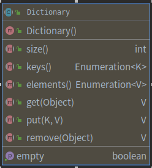
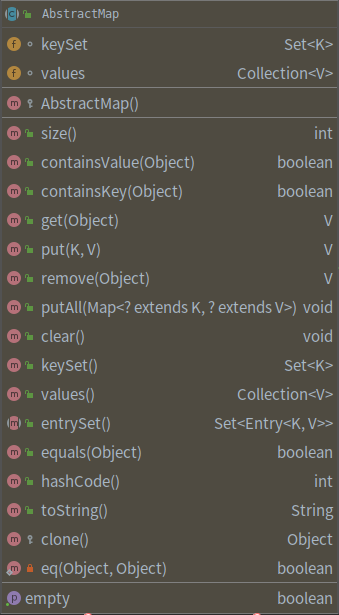

---
layout:     post
title:      Java集合框架系列
subtitle:    Hashtable
date:       2021-01-18
author:     子崖
header-img: img/post-bg-ios10.jpg
catalog: 	 true
tags:
    - Java
    - 集合框架
    - Hashtable
---
# Java 集合框架（Hashtable）

## Hashtable概述

Hashtable存储的是“键值对”的散列表，采用拉链法实现的

**存储思想**：

通过table数组存储，数组的没一个元素都是一个Entry;而一个Entry就是一个单向链表，Entry链表中的每一个节点就保存了Key-Value键值对数据。

## Hashtable特点

### Hashtable类的继承

HashMap继承于AbstractMap，实现了Map、Cloneable、Serializable接口;

Hashtable继承于Dictionary，实现了Map、Cloneable、Serializable接口;

Hashtable几乎所有的函数都是同步的，**即是线程安全的，支持多线程**

Hashtable的key、value都不可以是 **null**

Hashtable支持两种遍历方式 **Interator(迭代器)** 和 **Enumeration(枚举器)**

Hashtable遍历数组是 **“从后向前”**

Hashtable **默认的容量大小是11**, 增加容量时，每次将容量变为 **“原始容量 x 2 + 1”**

Hashtable没有自定义哈希算法，直接采用 **key的hashCode()**

