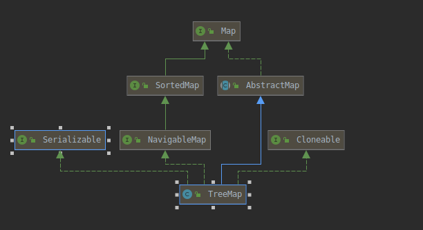

---
layout:     post
title:      Java集合框架系列
subtitle:    TreeMap
date:       2021-01-18
author:     子崖
header-img: img/post-bg-ios10.jpg
catalog: 	 true
tags:
    - Java
    - 集合框架
    - TreeMap
---

# Java 集合框架（TreeMap）

## TreeMap介绍

TreeMap是一个能够比较元素大小的Map集合，会对传入的Key进行大小排序。其中可以使用元素的自然顺序，也可以使用集合中自定义的比较器来进行排序。

TreeMap底层是基于红黑树实现的，它采用一种被称为“红黑树”的排序二叉树来保存Map中每个Entry。每个Entry被当成''红黑树'‘的一个节点对待。

TreeMap类的继承关系图

TreeMap继承于AbstractMap，实现了Map, Cloneable, NavigableMap, Serializable接口。

> 1. TreeMap 继承于AbstractMap，而AbstractMap实现了Map接口，并实现了Map接口中定义的方法，减少了其子类继承的复杂度；
> 2. TreeMap 实现了Map接口，成为Map框架中的一员，可以包含着key--value形式的元素；
> 3. TreeMap 实现了NavigableMap接口，意味着拥有了更强的元素搜索能力；
> 4. TreeMap 实现了Cloneable接口，实现了clone()方法，可以被克隆；
> 5. TreeMap 实现了Java.io.Serializable接口，支持序列化操作，可通过Hessian协议进行传输；

## TreeMap特点：

1. 不允许出现重复的Key;
2. 可以插入null键，null值;
3. 可以对元素进行排序;
4. 无序集合（插入和遍历顺序不一致）
