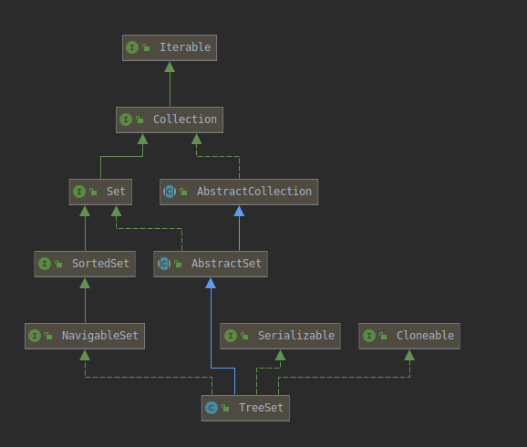

---
layout:     post
title:      Java集合框架系列
subtitle:    TreeSet
date:       2021-01-18
author:     子崖
header-img: img/post-bg-ios10.jpg
catalog: 	 true
tags:
    - Java
    - 集合框架
    - TreeSet
---

# Java集合框架（TreeSet）

## TreeSet介绍

TreeSet是一个有序的集合，它的作用是提供有序的Set集合

TreeSet的底层实际使用的存储容器就是TreeMap

TreeSet的类继承关系图

