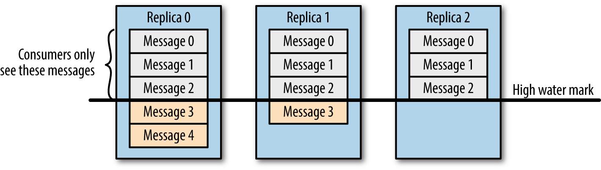

# Kafka知识总结

## 1. Kafka架构

kafka的架构图：

Kafka架构的主要组成部分：

1. **producer**：消息生产者
2. **Consumer**：消息消费者
3. **Topic**：可以理解为一个队列，一个Topic又分为一个或多个分区。
4. **Consumer Group**：
   1. 这是Kafka用来实现一个Topic消息的广播和单播的手段，
   2. 一个topic可以个有多个Consumer Group。
5. **Broker**：
   1. 一台Kafka服务器就是一个broker，
   2. 一个集群由多个broker组成，
   3. 一个broker可以容纳多个topic。

6. **Partition**：
   1. 为了实现扩展性，一个非常大的topic可以分布到多个broker上，
   2. 每个partition是一个有序的队列。
   3. partition中的每条消息都会被分配到一个有序的ID(offset)
   4. 将消息发送给consumer，kafka之保证按一个Partition中的消息的顺序，不保证一个topic的整体顺序。

7. **Offset**：

   1. kafka的存储文件都是按照offset.kafka来命名的，

   2. 用offset做名字的好处是方便查找

      

## 2. kafka有那些特点

1. **高吞吐、低延迟**：kafka每秒可以处理几十万条消息，延迟最低只有几毫秒
2. **可扩展性**：kafka集群支持**热**扩展
3. **持久型、可靠性**：消息被持久化到本地磁盘中，并且支持数据备份防止数据丢失
4. **容错性**：允许集群中节点失败(若副本为n, 则允许n-1个节点失败)
5. **高并发**：支持数千个客户端的同时读写

## 3. 那些场景下选择Kafka

1. **日志收集**：用kafka收集各种服务的log，通过kafka以统一接口服务的方式开放给各consumer 如Hadoop、HBase等
2. **消息系统**：用于解耦系统，降低系统间耦合度。
3. **用户活动跟踪**：kafka经常被用来记录web用户或app用户的各种活动，然后消费者订阅相关topic做实时监控分析或装载到Hadoop、数仓中做离线分析和挖掘。
4. **运营指标**：kafka经常用来记录运营监控数据。
5. **流式处理**：Spark Streaming和FLink

## 4. kafka分区的目的

1. **对于集群的好处**：实现负载均衡
2. **对于消费者的好处**：可以提高并发度

## 5. kafka是如何做到消息的有序性？

1. kafka中的每个partition中的消息在写入时是有序的
2. 而且单独一个partition只能一个消费者消费，可以保证消息的顺序性
3. 但是分区之间消息是不保证有序的

## 6. Kafka的高可靠性是怎么实现的？

1. **数据可靠性**：
   1. **Topic分区副本**：
      1. Kafka在0.8.0之后引入分区副本机制
      2. 每个分区可以人为设置几个副本
      3. 多个副本间，有一个Leader，其余的都是follower
      4. 所有 **写**操作都是由Leader进行的，同时，follower会定期去leader上复制数据
      5. 当leader挂掉后，其中一个follower会重新成为leader
      6. 通过分区副本引入了数据冗余，但是提供了数据可靠性
   2. **消息确认机制（ack）**：
      1. 实质是可人为设置分区几个副本实现同步才算消息发送成功
      2. **ack=0**-相当于异步发送，消息发送完毕后即offset增加，继续生产
      3. **ack=1**-leader收到leader副本消息接受ack就增加offset，继续生产
      4. **ack=-1**-leader收到所有副本消息接受ack才增加offset，在继续生产
   3. **Leader选举机制**：
      1. ISR队列：每个分区的leader都会维护一个ISR列表，其中记录这follower副本的Borker编号，只有跟得上Leader的follower副本才能加入到ISR里面。
      2. 只有ISR成员才会被选举为leader
      3. 当follower副本超出阈值，就会被剔除ISR，进入OSR，进加入的Follower也会进入OSR队列，待其数据跟上leader时，可进入ISR队列（replica.lag.max.messages--延迟条数，replica.lag.time.max.ms---延迟时间）

2. **数据一致性**

   **High water mark** : ISR队列中所有副本偏移量最小的分区

   

   kafka中只有高于**High water mark**的部分才支持Consumer读取，类似木桶原理。

## 7. ISR、OSR、AR是什么？

**ISR** ：In-Sync Replicas副本同步队列

**OSR**：Out-Sync Replicas

**AR**：Assigned Replicas所有副本

ISR是由leader维护的，follower从leader同步数据会有一些延迟，超过 **延迟条数**或 **延迟时间**的阈值就会把follower剔除ISR,存入OSR列表，新加入的follower也会先存放到OSR中

AR = ISR + OSR

## 8. LEO、HW、LSO、LW等分别代表什么？

1. **LEO**：是LogEndOffset的简称，代表当前日志文件中下一条
2. **HW**：水位或水印（watermark），取partition对应的ISR中最小的LEO作为HW，consumer最多只能消费到HW所在位置的上一条消息
3. **LSO**：是LastStableOffset的简称
   1. 对未完成的事务而言，LSO的值等于事务中第一条消息的位置，
   2. 对于以完成的事务而言，LSO的值等同于HW

4. LW：Low Watermark低水位， 代表AR集合中最小的logStartOffset值

## 9. 数据传输的事务有几种？

1. **at-most-once**：最多一次，消息不会被重复发送，最多传输一次，但也可能一次不传输
2. **at-least-once**: 最少一次，消息不会被漏发送，最少被传输一次，但也可能被重复传输
3. **exactly-once**：精确一次，不会漏传也不会重复，每个消息都会被传输接受

## 10.kafka消费者是否可以消费指定分区消息？

kafka consumer消费消息时，向broker发出fetch请求去消费特定分区的消息，consumer指定消息在日志中的偏移量(offset)，就可以消费从这个位置开始的消息，consumer拥有了offset的控制权，就可以向后回滚去重新消费之前的消息，这很有意义。

## 11. Kafka消息是采用的Pull模式还是Push模式？

kafka采用的是Producer端push消息到kafka，再由consumer端pull模式拉取数据。

这样做既有有点也有缺点：

**优势：**

		1. pull模式对于不同消费速率的consumer友好
  		2. consumer可以自主决定是否批量的从broker拉取数据

**劣势：**

 1. 当broker没有可供消费的数据是，将导致consumer不断的在循环中轮询，直到新的消息到达。

    **卡夫卡针对劣势的优化策略**：可以设置参数让consumer阻塞直到新的消息到达（也可以阻塞直到消息的数量到达某个特定的量，这样就可以批量发送）

## 12. kafka高效文件存储设计特点

1. kafka吧topic中一个partiton的打文件分成多个小文件段，通过多个小文件段，就容易定期清除或删除已经消费完文件，减少磁盘占用。
2. 通过索引信息可以快速定位message和确定response的最大大小
3. 通过index元数据全部映射到memory中，可以避免segment file 的IO磁盘操作。
4. 通过索引文件稀疏存储，可以大幅减低index文件元数据占用空间大小。

## 13. kafka创建Topic时如何将分区放置在不同的broker中？

1. 副本因子不能大于Broker的个数。
2. 第一个分区(编号0)的第一个副本放置位置是随机从brokerList选择的。
3. 其他分区的第一个副本放置位置相对于第0个分区依次向后移。
4. 其余的副本相对于第一个副本放置的闻之其实是有nextReplicaShift决定的，而这个数也是随机产生的。

## 14. kafka新建分区会在那个目录下创建？

1. 存储目录配置参数：log.dirs
2. 该参数可以配置多个目录，之间用逗号间隔
3. 配置多目录的目的是将目录分布在不同的磁盘上用于提高读写性能。
4. 如果只配置了一个目录，那么分配到各个broker上的分区只能在此目录下常见文件夹用于存储数据
5. 如果配置了多目录，kafka会在含有分区目录最少的文件夹中创建新的分区目录，分区目录名为：Topic名+分区ID。

## 15. 谈一谈Kafka的再均衡

1. 当用新的消费者加入或订阅的topic数发生变化时，会触发Rebalance机制
2. Rebalance就是重新均衡消费者i消费。
3. Rebalance过程如下：
   1. 所有成员都向coordinator发送请求，请求如组。一旦所有成员都发送了请求，coordinator会从中选择一个consumer担任leader角色，并把组成员信息以及订阅信息发送个leader
   2. leader开始分配消费方案，指明具体指明哪个consumer负责消费哪些topic的哪些partition，一旦完成分配，leader会将这个方案发送给coordinator，
   3. coordinator接收到方案后，会把方案发送给各个consumer，这样组内的所有成员就都知道字节应该消费哪些分区了。

## 16. Kafka分区分配策略

在kafka内部存在这两种默认的分区分配策略：**Range** 和 **RoundRobin**。

kafka分区分配触发条件：

 1. 同一个消费组内新增消费者

 2. 消费者离开当前所属的Consumer Group，包括shuts down 或 crashes

 3. 订阅的主题新增分区

    Rebalance就涉及到了分区分配策略。

    > 示例：有主题T1, 包含10个分区， 两个消费者（c1, c2）
    >
    > ​			消费线程：c1 :num.streams = 1; c2:num.streams =2
    >
    > 

**分区分配策略：**

1. **Range Strategy：**

   1. 原理：

      ​			分区按照序号排序，消费者线程按照字母顺序排序，

      ​            然后  $num(分区)/num(线程)$  ，如果除不尽，那就

      ​            前面几个消费者多消费一个分区

   2. 示例：C1-0---> 0,1,2,3分区; C2-0--->4,5,6分区; C2-1-->7,8,9分区

2. **RoundRobin Strategy**:

   1. 条件：同一个消费者组中的消费者num.streams必须相等

      ​			每个消费者订阅的主题必须相同

   2. 原理：将所有主题的分区组成TopicAndPartition列表，然后对ToipcAndPartition列表按照hashCode进行排序，然后按照roudn-robin的风格将分区分别分配给不同的消费者线程。

   3. 示例：假如按照 hashCode 排序完的topic-partitions组依次为T1-5, T1-3, T1-0, T1-8, T1-2, T1-1, T1-4, T1-7, T1-6, T1-9，我们的消费者线程排序为C1-0, C1-1, C2-0, C2-1，最后分区分配的结果为： 

      ​    C1-0 将消费 T1-5, T1-2, T1-6 分区；
        C1-1 将消费 T1-3, T1-1, T1-9 分区；
        C2-0 将消费 T1-0, T1-4 分区；
        C2-1 将消费 T1-8, T1-7 分区。

## 17.kafka是如何实现高吞吐率的？

kafka分布式消息系统在处理海量数据时，将所有数据都存储到写入速度低容量大的磁盘，以此来换取更强的存储能力，但是实际上，使用磁盘并没用带来过多的性能损失，其原因就是kafka主要使用了一下几个方式实现的高吞吐率：

1.  顺序读写：
2. 零拷贝：
3. 文件分段：
4. 批量发送：
5. 数据压缩：

## 18. Kafka的缺点：

1. 批量发送，非真正实时 ==？==
2. 对于mqtt协议不支持
3. 不支持物联网传感器数据直接接入
4. 仅支持同一分区内消息有序，无法实现全局消息有序
5. 监控不完善，需要插件

## 19. kafka新旧消费者的区别

1. 旧的消费者API：两种SimpleConsumer 和zookeeperConsumerConnectir
2. 新的消费者API：同时支持上述两种行为

## 20. kafka分区数可以增加或减少吗？

==可以增加，但是不能减少==

使用bin/kafka-topics.sh 可以对kafka增加分区
